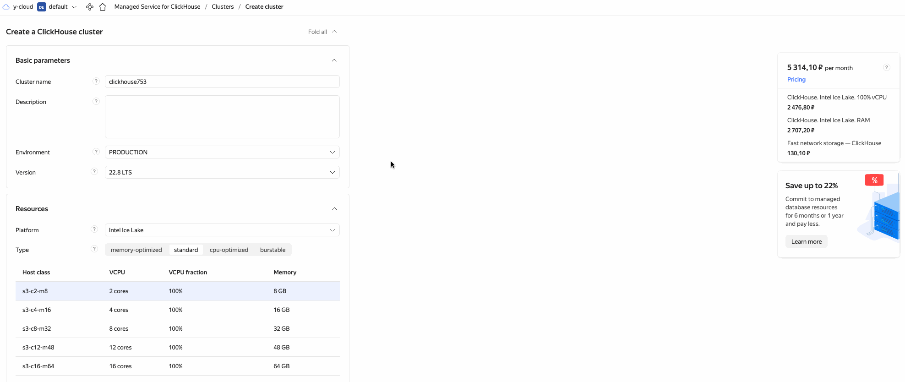

# Clickhouse + dbt: Starschema showcase

⚠️ Attention! Always delete resources after you finish your work!


## Assignment TODO

- [x] .gitignore (+ terraform)
- [x] terraform return cluster host (don't hardcode)
- [ ] secrets handling
- [ ] asciinema record
- [ ] Test assinment using Github Actions


How to pass assignment

- [ ] One
- [ ] Two

## 1. Deploy Clickhouse

1. Get familiar with Managed Clickhouse Management Console

    

1. Install yc CLI: [Getting started with the command-line interface by Yandex Cloud](https://cloud.yandex.com/en/docs/cli/quickstart#install)

1. Set environment variables:

    ```bash
    export YC_TOKEN=$(yc iam create-token)
    export YC_CLOUD_ID=$(yc config get cloud-id)
    export YC_FOLDER_ID=$(yc config get folder-id)
    ```

1. Deploy using Terraform

    - [EN] Reference: [Getting started with Terraform by Yandex Cloud](https://cloud.yandex.com/en/docs/tutorials/infrastructure-management/terraform-quickstart)
    - [RU] Reference: [Начало работы с Terraform by Yandex Cloud](https://cloud.yandex.ru/docs/tutorials/infrastructure-management/terraform-quickstart)


    ```bash
    cd ./terraform
    terraform init
    terraform validate
    terraform fmt
    terraform plan
    terraform apply
    ```


## 2. Configure developer environment

Install dbt environment with [Docker](https://docs.docker.com/desktop/#download-and-install):

```bash
# set environment variables
export DBT_HOST=$(terraform output -raw clickhouse_host_fqdn)
export DBT_USER=admin
export DBT_PASSWORD=$(terraform output -raw )

# build & run container
docker-compose up -d

# alias docker exec command
alias dev="docker-compose exec dev"
```

<details><summary>Alternatively, install dbt on local machine</summary>
<p>

[Install dbt](https://docs.getdbt.com/dbt-cli/install/overview) and [configure profile](https://docs.getdbt.com/dbt-cli/configure-your-profile) manually by yourself. By default, dbt expects the `profiles.yml` file to be located in the `~/.dbt/` directory.

Use this [template](./profiles.yml) and enter your own credentials.
</p>
</details>

## 3. Check database connection

### dbt

```bash
dev dbt debug
```

### JDBC (DBeaver)

[Configure DBeaver connection](https://cloud.yandex.ru/docs/managed-clickhouse/operations/connect#connection-ide):

```
port=8443
socket_timeout=300000
ssl=true
sslrootcrt=<path_to_cert>
```

## 4. Stage data sources with dbt macro

Source data will be staged as EXTERNAL TABLES (S3) using dbt macro [init_s3_sources](./macros/init_s3_sources.sql):

```bash
dev dbt run-operation init_s3_sources
```

Statements will be run separately from a list to avoid error:

```
DB::Exception: Syntax error (Multi-statements are not allowed)
```

## 5. Deploy DWH

1. Describe sources in [sources.yml](./models/sources/sources.yml) files

1. Install dbt packages

    ```bash
    dev dbt deps
    ```


1. Build staging models:

    ```bash
    dbt build -s tag:staging
    ```

    Check model configurations: `engine`, `order_by`, `partition_by`

1. Prepare wide table (Data Mart)

    Join all the tables into one [lineorder_flat](./models/):

    ```bash
    dbt build -s lineorder_flat
    ```

    Pay attentions to models being tested for keys being unique, not null.
## 6. Model read-optimized data marts

See queries at: https://clickhouse.tech/docs/en/getting-started/example-datasets/star-schema/
Possibly materialize results as new tables (views) with dbt

Push Git repo with dbt project to Github:
- external tables to S3
- sources.yml
- base tabes
- wide table
- tests and docs for models

https://clickhouse.tech/docs/en/getting-started/example-datasets/star-schema/

Send results of queries: 
- Q2.1
- Q3.3
- Q4.2

## Shut down your cluster

⚠️ Attention! Always delete resources after you finish your work!


```bash
cd ./terraform
terraform destroy
```

## Lesson plan

- [ ] Deploy Clickhouse
- [ ] Init dbt project
- [ ] Install environment – dbt + clickhouse dependency
- [ ] Configure project (dbt_project)
- [ ] Configure connection (profile)
- [ ] Prepare source data files (S3)
- [ ] Configure EXTERNAL TABLES (S3)
- [ ] Describe sources in .yml files
- [ ] Basic dbt models and configurations
- [ ] Code compilation + debugging
- [ ] Prepare STAR schema
- [ ] Querying results
- [ ] Testing & Documenting your project
